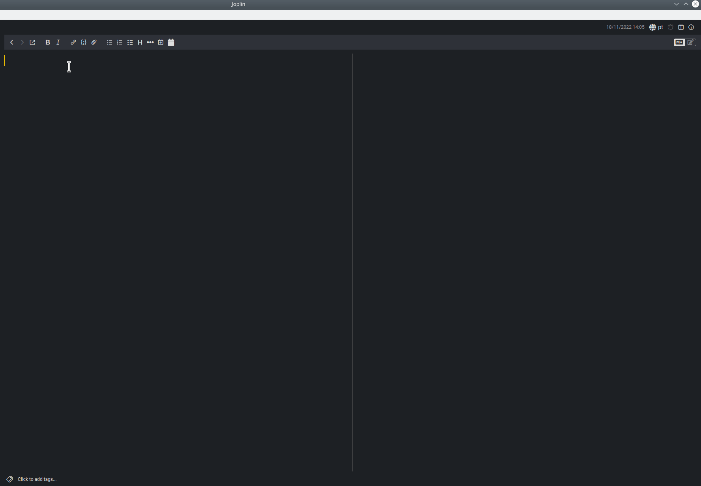

# WS Timestamper

This plugins creates a button to insert a custom timestamp in the current note.
To be honest, it actually inserts a datestamp, not a timestamp, but you can
customise the format very easily.



in order to do it, just clone the repo, change the format inside the file `src/index.ts`, then regenerate the
plugin with `npm run dist`. The plugin will be in the `publish` directory.

This is the function that needs to be updated:

```typescript

function getTimeStamp() {
        const d = new Date();
        const months = ["January", "February", "March", "April", "May", "June", "July", "August", "September", "October", "November", "December"];
        const days = ["Sunday", "Monday", "Tuesday", "Wednesday", "Thursday", "Friday", "Saturday"];

        let year = d.getFullYear();
        let month = months[d.getMonth()];
        let day = d.getDate();
        let wday = days[d.getDay()];

        let timestamp = `\[ ${wday}, ${day} of ${month}, ${year} \]\n\n`.toLowerCase();
        return timestamp;
}

```

To learn more about creating Joplin plugins, visit [here](https://joplinapp.org/api/get_started/plugins/).
